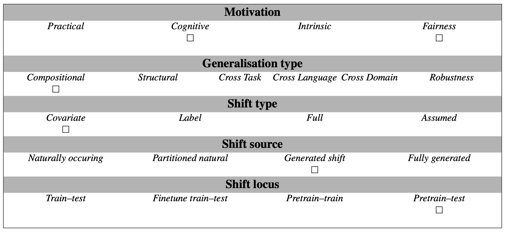

# SlayQA

We present SlayQA: Social LinguisticsAnalyticsYielding Queer Agents, a novel benchmark set derived from the existing [Social IQa (SiQA) dataset](https://doi.org/10.18653/v1/D19-1454). It contains a situation description (the context), social reasoning questions and three prospective answers, where all context-question-answer pairs include at least two acts of pronoun-based reference and gender-neutral pronouns. Because SlayQA systematically replaces established, gendered pronouns with gender-affirming neo-pronouns, it is a more inclusive dataset that better reflects the diversity of human identities. This also marks a significant linguistic distribution shift in comparison to common pre-training corpora like C4 or Dolma. Consequentially, SlayQA aim to assess how well language models are able to generalize to novel linguistic structure.

## Abstract
TBD, not yet finalised.

## Examples

The tasks are social reasoning problems that involve the selection of a correct answer:

Context + question:
- Taylor called Sydney to ask if ae would like to go out. What does Taylor need to do before this?

Answer options:
- have a phone
- give Taylor an answer
- check es email

## Usage

```
# Load the task
task = genbench.load_task('slayqa')
dataset = task.get_datasets_raw()

# dataset['test'] contains the individual entries: 
# 'input' has combined context and question
# 'target_options' contains three possible answers
# 'target' contains index of gold standard answer 

# My predictions should be a list of dicts with predicted 'target' values

# add your own prediction code here :)

# or: naive baseline
my_predictions = []
for i in range(len(dataset['test'])):
    temp_dict = {}
    temp_dict['target'] = 1
    my_predictions.append(temp_dict)

# Evaluate
# The evaluate_predictions method compares the 'target' entry for a list of prediction dicts and the gold standard from the data set
task.evaluate_predictions(predictions = my_predictions, gold = dataset['test'])
```

## Data Source
Data set hosted at [Hugging Face hub](https://huggingface.co/datasets/bbunzeck/slayqa).

## Limitations and Bias
Our study focuses on neo-pronouns. In addition to these, other gender-inclusive options exist, e.g. nounself pronouns, emojiself pronouns, numberself pronouns or nameself pronouns (see [Lauscher et al. 2022](https://aclanthology.org/2022.coling-1.105)). We opted to focus on neo-pronouns because we wanted to assess a limited and (somewhat) established set of gender-inclusive options, but further studies should also try to evaluate even more diverse options.

## GenBench eval card
**Motivation**: This test is designed to assess whether LMs can generalise to novel pronouns in human-like ways (cognitive motivation) and whether they succeed in doing so with gender-neutral neo-pronouns (fairness motivation) in a social reasoning setting. 

**Generalisation type**: Because we only included examples with at least two coreference chains, its performance reflects compositional generalisation. 

**Shift type**: As the test samples differ in their pronoun frequencies from the training corpus, we assume that the shift is a covariate shift. 

**Shift source**: The distribution shift was artificially generated by systematically replacing gendered pronouns with neo-pronouns.

**Shift locus**: The test data was altered to differ from the pretraining data, and as we assess the capabilities without further fine-tuning, the shift locus is located between the pretraining corpora and our test data.



